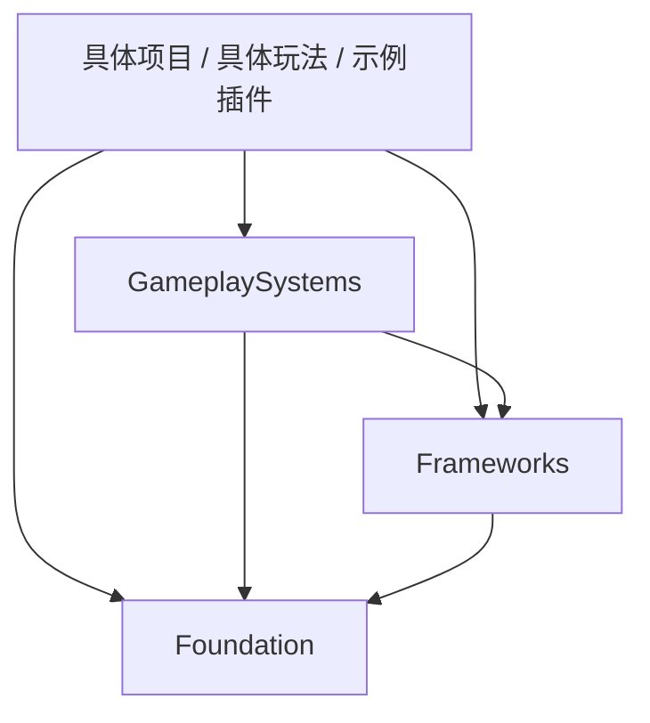

# Custom 插件架构约定

本目录维护 Omni 的可复用插件。实现对照基准为 **Lyra 5.8**；插件边界按自身职责与依赖关系划分，不要求与 Lyra 的目录一一对应。

代码插件采用 `Foundation → Frameworks → GameplaySystems` 三个层级，由基础服务逐步构建框架与玩法系统。这里的层级是项目架构约定，不是 UE 根据文件夹名称自动执行的依赖限制。

## 1. 目录与职责

```text
Custom/
├── Foundation/       L1：独立公共机制与服务
├── Frameworks/       L2：系统框架、生命周期与扩展契约
├── GameplaySystems/  L3：可组合的玩法与表现功能
├── Content/          共享与示例内容，不计入代码层级
│   ├── SharedContent/   共享内容
│   └── ExampleContent/  示例内容
└── README.md
```

| 层级 | 应承担的职责 | 不应承担的职责 |
|---|---|---|
| L1 · Foundation | 消息通信、异步加载、加载屏、用户与会话、通用设置、字幕等独立公共服务，以及对引擎能力的基础封装 | 编排上层玩法；引用 Frameworks、GameplaySystems 或具体项目实现 |
| L2 · Frameworks | 定义输入、能力系统、UI、Experience 等系统的组织方式、初始化流程、生命周期和扩展接口 | 固定某一种游戏的武器、物品、关卡或胜负规则；依赖 GameplaySystems 的具体实现 |
| L3 · GameplaySystems | 在公共服务和框架上提供库存、装备、交互、队伍、外观、指示器等可选功能 | 反向要求基础层或框架层引用自己；承载仅适用于某个具体游戏的配置与流程 |

分层依据是职责和依赖方向，不是代码量、开发先后或是否从 Lyra 移植。Foundation 可以包含完整的公共服务，例如 GameUser、GameSettings，并不限于小型工具函数。

当前插件归属：

| 目录 | 插件 |
|---|---|
| Foundation | AsyncLoadMixin、GameSettings、GameSubtitles、GameUser、LoadingScreen、MessageRouters、ModularGameplayActors、PocketWorlds、StartupLoadingScreen |
| Frameworks | GameUI、GameUIExtension、AbilityExtension、ExperienceSystem、CoreExtension、HelperFunctions |
| GameplaySystems | CustomCosmetics、CustomEquipment、CustomIndicator、CustomInteraction、CustomInventory、CustomTeam |
| Content | SharedContent（共享内容）：正式共享资源；ExampleContent（示例内容）：插件使用展示 |

`Frameworks/CustomSaveGame` 当前仅为预留目录，没有插件描述或实现，不计入现有插件清单。

## 2. 依赖规则

下表的行是使用方，列是被依赖方；“同层单向”表示可以组合，但不能形成循环。

| 使用方 | Foundation | Frameworks | GameplaySystems |
|---|---|---|---|
| Foundation | 同层单向 | 禁止 | 禁止 |
| Frameworks | 允许 | 同层单向 | 禁止 |
| GameplaySystems | 允许 | 允许 | 同层单向 |
| 具体项目、具体玩法或示例插件 | 允许 | 允许 | 允许 |

箭头表示“使用方依赖被依赖方”：



1. **上层可以直接使用任意下层。** 不要求逐层转发。`OmniGame → GameplaySystems` 和 `GameplaySystems → Foundation` 都是正常关系。
2. **同层允许有明确方向的组合。** 例如 `CustomEquipment → CustomInventory`、`CustomInteraction → CustomIndicator`。直接依赖和传递依赖都不能形成循环。
3. **可复用插件不依赖具体使用方。** 三层插件不能引用 OmniGame、具体玩法插件或示例插件的类、配置与资产。项目负责组装可复用能力。
4. **跨层协作通过契约完成。** 基础层或框架层需要上层提供行为时，在自身或共同下层定义接口、委托、消息或可配置入口，由上层实现与注册；不能为了访问具体实现而反向引用上层。
5. **所有实际依赖都要纳入检查。** 既检查 `.uplugin` 的插件依赖，也检查 `Build.cs` 的 Public、Private、动态加载等模块关系。Private 依赖同样受分层规则约束，直接使用其他插件时应明确声明对应依赖。
6. **资产也遵守依赖方向。** 蓝图父类、数据资产、材质、软引用和字符串加载路径都可能建立实际耦合。改用软引用或消息通信，不代表可以绕过层级约束；还要检查被引用的数据类型和资源来自哪里。
7. **运行时与编辑器职责分离。** 仅用于编辑器或开发工具的实现放在适合该用途的模块中，运行时模块不依赖编辑器模块。

例如，`ExperienceSystem → AbilityExtension` 在两者同属 Frameworks 时是合理组合；AbilityExtension 已合并输入绑定；若将它归入 GameplaySystems，就会违反框架层不依赖玩法系统层的约定。

## 3. 正式共享内容与示例插件

### 正式共享内容

`Content/SharedContent` 的显示名称为 **共享内容**，用于存放可供正式项目复用的共享资源。插件标识为 `SharedContent`，资产挂载路径为 `/SharedContent/`。

- 项目、具体玩法和需要这些资源的插件可以按需引用正式共享内容。
- 共享内容应保持自身的复用边界，不反向引用具体项目或示例插件。
- 若共享资产使用某个代码插件的类，需将这种关系纳入完整依赖图；不能通过内容插件间接形成循环或绕过三层依赖限制。
- 后续若调整插件标识或迁移资产，应同时核对资源引用与插件挂载路径；显示名称变更不涉及资产内容修改。
- 本次重命名前，共享资产使用 `/ExampleContent/` 路径。`SharedContent/Config/DefaultSharedContent.ini` 为这批既有资产逐项配置包路径重定向，兼容尚未重存的旧引用，资产文件保持原样。示例插件新增资产使用自己的 `/ExampleContent/` 路径，不配置整个前缀的重定向；应避免复用兼容映射中已占用的旧包路径。

### 示例内容

`Content/ExampleContent` 的显示名称为 **示例内容**，用于展示各插件的接入方法、必要配置、运行流程和预期结果。插件标识为 `ExampleContent`，资产挂载路径为 `/ExampleContent/`。当前已创建纯内容插件骨架，演示资产后续逐步补充；插件默认不启用，在需要演示的项目中按需启用。

- 示例插件是三层插件的使用方，可以组合它们并引用正式共享内容。
- 当前尚无演示资产，不预设功能插件依赖；加入示例时，在插件描述中明确声明实际使用的插件。
- 可复用代码插件和正式共享内容不能依赖示例插件。
- 每个示例应说明所需插件、接入步骤、演示入口和验收方式。
- 示例中的演示关卡、专用角色与教学配置留在示例插件；可供正式项目复用的资源按职责归入共享内容或所属功能插件。
- 示例插件作为可选展示入口，正式项目无需启用它即可使用被展示的插件。

Content 与示例是按用途划分的类别，不是第四、第五个代码层级。GameplaySystems 也不等同于 UE 的 GameFeature 插件类型：是否采用 GameFeature 的注册与激活机制，需要另外设计。

## 4. 维护与后续完善

- **目录与元数据一致。** 调整归属后，对应 `.uplugin` 的 Category 应同步为 `ZHY|Foundation`、`ZHY|Frameworks`、`ZHY|GameplaySystems` 或 `ZHY|Content`。FriendlyName、Description 应准确描述插件本身。
- **按最终目录继续完善。** 当前已完成目录调整；部分 Category 仍使用 BasicExpand、Features 等旧值，留待后续统一，不能仅凭插件浏览器的旧分类判断实际层级。
- **HelperFunctions 继续梳理职责。** 当前包含对象池和脸部 SDF 阴影组件；对象池 Actor 通过 ExtTaggedActor 依赖 AbilityExtension。在解除相应依赖前保持其 Frameworks 归属，后续再按职责整理，避免直接下移造成反向依赖。
- **飞书云文档统一重建。** 待本轮插件完善全部完成后，基于最终代码、目录与本约定重新生成一份飞书云文档。
- **最后逐个对照 Lyra 5.8。** 届时分别核对职责边界、接口与实现差异、接入流程、示例和验证结果；不将目录归类完成等同于功能对照完成。

本 README 维护目录级架构约定；各插件的详细用法由后续示例与最终飞书文档承载。
